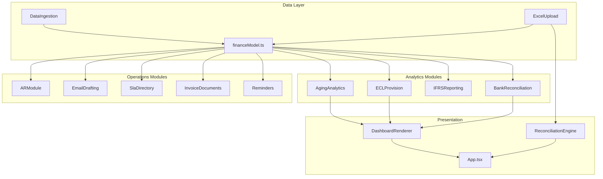
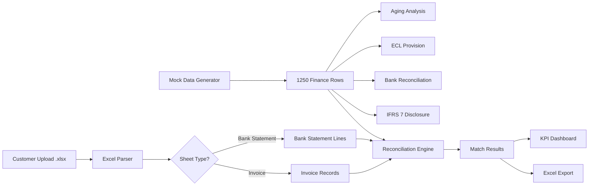

# O2C Finance Command Center Architecture

## Stack Alignment

The target architecture is Microsoft-stack-oriented and local-first:

- **Runtime**: TypeScript offline web app for this scaffold because `.NET` is not installed on this machine.
- **Future Microsoft desktop target**: .NET 8 WPF or WinUI 3 with the same module boundaries.
- **UI paradigm**: Windows-like shell with left rail, ribbon tabs, panes, dense tables, and approval drawers.
- **Data**: deterministic local mock generator with 1,250 generic O2C AR rows.
- **Excel**: local `.xlsx` reports are generated with the bundled workbook writer. Upload parsing uses `fflate` for ZIP decompression.
- **Charts**: Custom SVG/CSS components (Line, Donut, Gauge, Heatmap, Stacked Bar, Sparkline) — no external charting library.
- **Operation**: no web search or external services needed for the app workflows.
- **Deployment**: Vercel preview can host the static UI; daily workflows and Excel exports run locally.

## Module Boundaries



- `DataIngestion`: deterministic mock AR and bank statement generation.
- `AgingAnalytics`: normal AR aging without the ECL-only 120-day bucket.
- `ECLProvision`: IFRS 9/ECL aging with Current, 1-30, 31-60, 61-90, 91-120, 121-180, and 180+ buckets; 180+ is fully provisioned.
- `IFRSReporting`: IFRS 7 disclosure cues, BU DSO, credit-risk concentration, liquidity exposure, CEO control index.
- `ARModule`: Oracle Fusion-style invoice status transitions, close workflow, comments, audit trail.
- `EmailDrafting`: humanized SOA email drafts using offline SLA/contract email IDs.
- `SlaDirectory`: customer account number lookup for SLA, contract, collector, escalation, and attachment preferences.
- `InvoiceDocuments`: dummy invoice PDF export/import queue and payment-proof audit records.
- `BankReconciliation`: morning bank matching with match confidence and exceptions.
- `Reminders`: security cheque, trade license, and document resubmission reminders.
- `DashboardRenderer`: Excel workbook export and UI rendering boundary.
- `ExcelUpload` **(new)**: .xlsx binary parser with column alias auto-detection and multi-criteria reconciliation engine.

## Data Flow



## Phased Roadmap

### Phase 1 MVP ✅

- Data generator with 1,000+ rows.
- Normal aging dashboard.
- ECL provisioning dashboard with 120-day bucket.
- Excel export for daily finance pack.
- Detailed transaction-level aging report in AED.
- Power BI-style in-app analytics dashboard with local browser Excel export.

### Phase 2 IFRS and AR Operations ✅

- IFRS 7 disclosure package.
- Oracle Fusion-style AR close/reopen/partial allocation workflow.
- Comment audit trail.
- Management review dataset.

### Phase 3 Automation and Reminders ✅

- Morning bank reconciliation output.
- SOA generation and email drafting.
- SLA account lookup, dummy invoice PDF export/import, and payment-proof audit flow.
- Cheque, trade license, and resubmission reminders.
- Approval-first AI-agent placeholder panes.

### Phase 4 Customer Upload & Enhanced Analytics ✅ (Current)

- **Excel upload** — Drag-and-drop .xlsx bank statement and invoice parsing.
- **Multi-criteria reconciliation** — Weighted confidence scoring across 5 criteria.
- **Enhanced KPI cards** — SparklineKpi with animated count-up and trend indicators.
- **New chart components** — LineChart, StackedBar, Gauge, Heatmap.
- **Customer risk heatmap** — Top 10 accounts × aging bucket heat matrix.
- **Collection efficiency gauge** — SVG arc with threshold colouring.
- **GitHub deployment** — Full documentation (README, AGENTS, SKILLS).

### Phase 5 (Planned)

- Real ERP connector (Oracle Fusion REST API, SAP OData).
- AI-powered matching suggestions for unmatched bank lines.
- Historical trend analysis with rolling DSO and collection rate tracking.
- Role-based access control with Azure AD integration.
- .NET 8 WPF desktop client with shared module contracts.

## Runbook

```powershell
npm install
npm run generate:data
npm run workflow:daily
npm run dev
```

The generated Excel pack is written to:

```text
reports/O2C-Daily-Finance-Pack.xlsx
```
