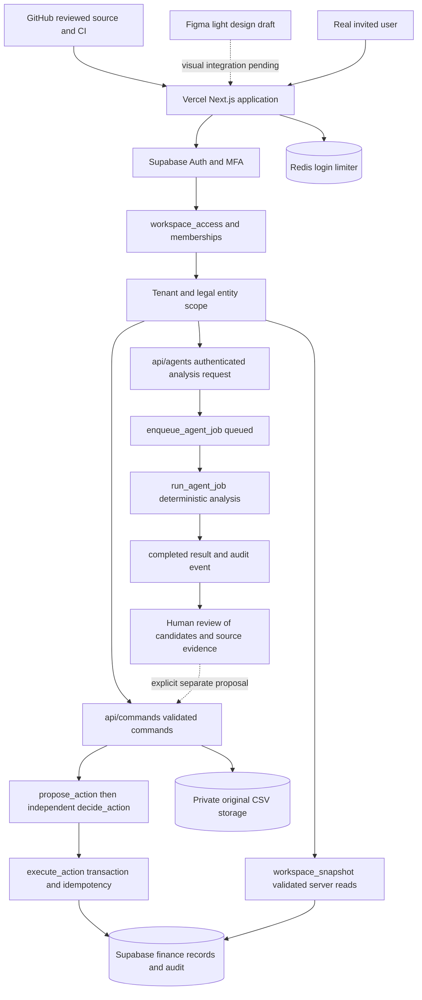

# AR and order-to-cash architecture

This map describes the reviewed Next.js release on `master` and the intended
light Figma redesign. Implementation, live configuration and end-to-end
qualification are separate. No autonomous ledger posting or message delivery is
claimed. See [cloud continuation](CLOUD_CONTINUATION.md) for release evidence.

## Cloud ownership

| System | Responsibility | Boundary |
| --- | --- | --- |
| GitHub | Maintained source, migrations, review and CI | No credentials or private business exports |
| Vercel | Next.js UI, authenticated server routes and API handlers | Runtime secrets configured in provider settings |
| Supabase Auth | User identities, sessions, enabled OAuth and MFA | Identity alone does not grant finance access |
| Supabase PostgreSQL | Memberships, entities, invoices, bank lines, receipts, allocations, proposals, jobs and audit | RLS and scoped transactional RPCs enforce authorization |
| Supabase private Storage | Original validated source CSV documents | Scoped immutable paths; current limit is 1 MB |
| Redis | Shared login account/IP rate budgets | Fail closed when required infrastructure is unavailable |
| Figma | Editable light workspace design | Draft, not a running frontend or finance backend |

Windows files are archival inputs to consolidation. Cloud runtime uses the
GitHub checkout and provider storage, not local Windows paths. Supabase stores
business records and evidence; Redis is not a finance ledger.

The dotted candidate-to-proposal edge is an operator workflow, not an automatic
job-to-ledger write. Analysis results do not create financial approvals.

## Orchestration and visible agents

The current orchestrator is the authenticated request path and database RPC
workflow. `src/app/api/agents/route.ts` validates origin, request envelope,
session and analysis scope, queues a job and immediately attempts execution.
There is no `src/lib/agent-jobs.ts` in this release. Execution lives in
`supabase/migrations/202610080002_agent_jobs.sql`.

| Agent | Implemented source-based result | Missing or deliberately separate |
| --- | --- | --- |
| AR | Open/overdue exposure and Current, 1–30, 31–60, 61–90, 90+ aging from posted invoices less allocations | DSO and credit-limit values remain unavailable without governed inputs; no credit-limit changes |
| Collections | Overdue undisputed invoice candidates and reviewable payment-date drafts, with source versions and a 100-detail limit | No delivery, two-way inbox, promise parsing or external email connector |
| Treasury | Unposted incoming credits, unapplied cash and exact-reference/exact-amount reconciliation candidates | Candidates do not settle invoices; forecasts use separately governed approved source runs |

`src/components/agent-analysis.tsx` displays the governed analysis queue inside
the Agent activity view. A maker or admin can request analysis. The UI shows
the agent, as-of date, requester, persisted state and expandable source result;
the original requester can resume their queued job. `src/app/page.tsx` reads
tenant/entity-scoped jobs and displays the latest 50 with an overflow notice.

Persisted job states are exactly `queued` and `completed`. The API attempts work
synchronously after enqueue; an interrupted request can leave a resumable queued
job. Do not animate fictitious workers or label jobs running, failed, scheduled
or sent when those states are not recorded. External `agent_runs` are a separate
activity feed, currently unconnected, and require authoritative domain outcomes.

A future master orchestration service can add durable scheduling, explicit
failure/retry states and authorized connectors. Each capability needs real
integration, persistence, audit and operational tests before the UI claims it.

## Order-to-cash lifecycle

| Stage | Current implementation | Remaining scope |
| --- | --- | --- |
| Order intake and fulfillment | No order-management subsystem | Governed ERP order/delivery integration and lineage |
| Customer and credit review | Scoped customer records and AR exposure | Credit-limit workflow and human approval for changes |
| Billing | Import verified entirely unpaid invoice records and display receivables | Invoice issuance, tax determination, credits and historical settlement imports |
| Collections | Separate collection/dispute states and source-based drafts | Authorized communication, inbox, promises and dispute settlement workflow |
| Cash capture | Import real bank lines; incoming credits can become receipt proposals | Live bank connector and additional settlement types |
| Cash application | Receipt/allocation proposals, independent decisions and separate posting | Governed handling of FX, refunds, write-offs and period locks |
| Reconciliation | Bank direction, posted receipts, residuals and deterministic candidates | Connector-backed reconciliation operations and exception resolution |
| Forecast and impairment | Governed direct-method 13-week forecast and preserved ECL runs | Approved source inputs, model governance and calibrated measurement process |
| Audit | Scoped immutable audit events, proposal evidence and private source archive | Retention qualification and tested backup/restore |

Invoice lifecycle (`posted`/`void`), settlement, dispute and collection are
distinct fields. A recommendation, an approved proposal and a posted operation
must remain visibly distinct. Approval states are `pending`, `approved`,
`rejected` and `posted`; approval does not itself post a receipt or allocation.

## Enforcement and next design phase

`src/lib/workspace.ts` validates snapshot scope and monetary contracts.
`src/app/api/commands/route.ts` routes proposal, decision, posting and import
commands to their scoped RPCs. Database checks enforce independent users,
current source versions, authorization, exact amounts and transactional posting.
Profiles are display identity attributes, not roles or workspace permissions.

The light redesign should give users a readable agent work queue, detailed
source evidence, a clear independent approval inbox and confirmed operation
history. Empty source data stays empty. Missing governed metrics stay
unavailable. Visual polish must preserve those operational distinctions.

Validate source changes with `npm run verify` and `npm audit`. Before declaring
the agent workflows production-qualified, verify real invited users, MFA,
ordinary-JWT tenant/entity isolation, independent approvals, repeated requests,
interrupted job resumption, private source access and hosted UI accessibility.
The latest release report's empty live account/workspace state is a provisioning
gap, not evidence of a completed user workflow.
