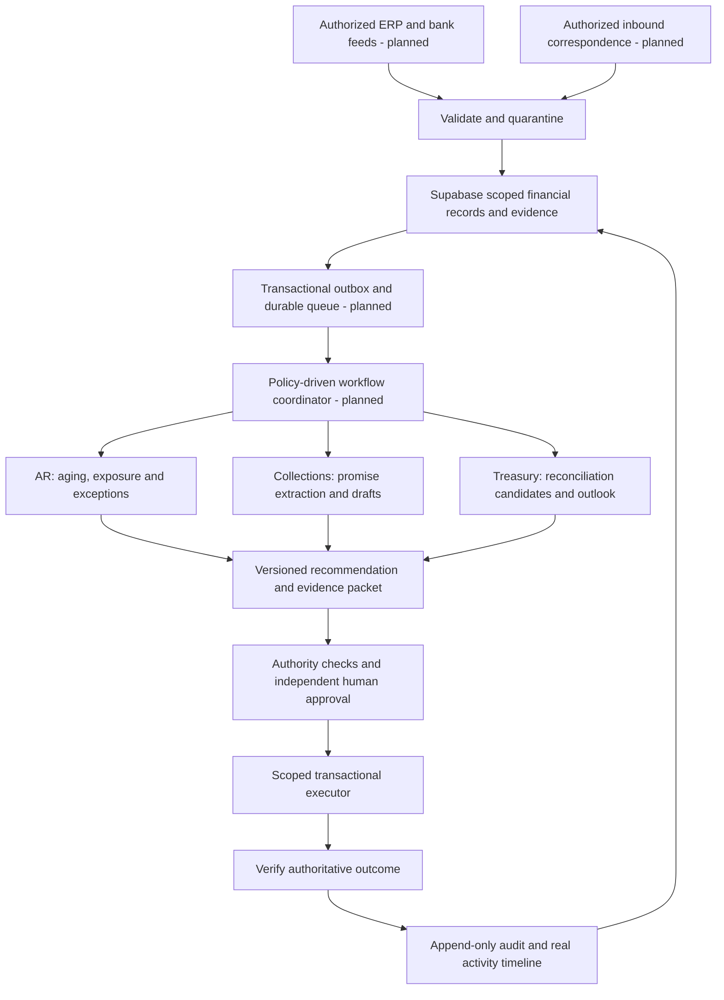

# Autonomous AR operating model
Proposed roadmap, 8 October 2026. This is a design and implementation plan, not a claim that autonomous workers or connectors have been deployed.

## Product direction
An exception-first AR workspace: each customer account has an evidence-backed next action, its authority, its source records and an accountable owner. Agents take permitted steps; financial changes retain the existing independent approval and transactional posting controls.

## Six practical innovations
| Capability | Useful behavior | Evidence and authority |
|---|---|---|
| Evidence packet for every recommendation | Bring invoice, receipt, bank reference, dispute history and prior promise into one review card | Source record IDs, captured versions, freshness, exact decimal amounts and a readable reason. Missing evidence blocks the proposal. |
| Payment-promise timeline | Extract a proposed promise from authorized inbound correspondence, ask for confirmation when ambiguous, and watch the confirmed commitment | Preserve original message reference, customer identity, date/currency/amount and confirmation. An LLM does not create a receipt or mark an invoice paid. |
| Exception graph | Group related discrepancies across invoice, remittance, receipt and bank statement into a case rather than separate alerts | Maintain tenant/entity-scoped record links. Show conflicts and unmatched evidence explicitly; avoid silent merging across accounts. |
| Shadow-mode cash application | Evaluate matching suggestions against reviewed historical results before allowing proposal creation | Measure precision, false matches, unmatched cases, amount conservation and reviewer overrides. No suggested match settles an invoice. |
| Governed cash outlook | Refresh the 13-week view when a confirmed promise, approved plan or posted receipt changes | Keep baseline source and scenario separate. Use approved input confidence only; do not manufacture probability from an arbitrary score. |
| Autonomy policies per action | Let administrators authorize bounded analysis, internal task creation and approved communication workflows | Tenant, entity, action, value limit, channel, expiry and reviewer rules. New authority cannot be inferred from a prompt or profile role. |

## Architecture

Current: Supabase financial storage, scoped access, exact arithmetic, deterministic AR/collections/treasury analyses, queued/completed job records, independent proposal/approval/post controls, private source uploads and audit.
Planned: connectors, durable worker scheduling, transactional external-action outbox, workflow leases/heartbeats, controlled communication delivery, evaluation and operational alerts. Existing API enqueues then attempts a synchronous database analysis; it is not yet a durable external worker orchestration service.

## Implementation boundaries
Keep Next.js as UI/API, Supabase as Auth and financial truth, private Storage as evidence, and Redis for the current login-limiter purpose. Do not move financial authorization into Redis, Figma or an LLM.
First evaluate a Postgres-native durable queue to fit the existing Supabase stack. Supabase documents Queues as a durable Postgres queue based on pgmq: https://supabase.com/docs/guides/queues . For workflows requiring long waits and multiple external systems, evaluate a durable workflow engine separately; Temporal documents recovery and replay: https://docs.temporal.io/tasks . No dependency or infrastructure service was added by this plan.
A queue acknowledgement is not proof that an external action succeeded. Every operation needs a stable idempotency key, provider acknowledgement, reconciliation query, outcome record, timeout handling and duplicate protection.
Future job states must be explicit: queued, leased/running, waiting_for_review, succeeded, retryable_failure, terminal_failure and outcome_unknown. Do not map an unknown provider outcome to success. Current code only supports queued/completed.
Use model-assisted extraction/explanation through constrained schemas and source references. Deterministic code handles money, dates, matching constraints, authority and execution. Never use an LLM to calculate ledger amounts, assign permissions or bypass maker/checker.
Sending messages requires configured, authorized channels and an explicit policy/approval. No message was sent during this task. High-value transactions, disputes and credit changes require human review under the user's guardrails.

## Enterprise user experience
Show cases and next actions ahead of charts: why the item matters, source freshness, agent recommendation, permitted action, required approval and outcome.
Agent cards and timelines read persisted server records. A running indicator needs a real active lease/heartbeat; no animated pretend work. Reviewers see amount, scope, evidence, proposed change and stale-record checks before approval.
Mobile emphasizes the exception inbox, promise review and approvals. Large reconciliation tables become drill-down views with accessible headers; preserve a desktop route for complex evidence review.
Portfolio controls include per-tenant limits, pause/kill switch, source-health status, retry/backlog visibility and a clear distinction between recommendation, approved action and verified completion.

## Delivery sequence and acceptance
1. Qualify current real-user login, memberships, MFA, cross-tenant denial, imports, independent approval and posting. Keep the new light UI and existing financial controls.
2. Connect one real source in read-only mode. Validate freshness, duplicate handling and exact amounts against authoritative records.
3. Add outbox, durable leases, worker recovery and explicit job states. Prove restart recovery, duplicate delivery, cross-scope denial and unknown-outcome reconciliation.
4. Ship evidence packets, promise review and shadow matching. Use reviewed real outcomes for acceptance; do not invent accuracy or financial improvement.
5. Enable one approved external action at a time under explicit policy. Expand only after audit, reliability and quality gates pass.

Measure verified outcomes: unmatched cash resolved, overdue cases with an accountable next action, promise completion, wrong-match rate, reviewer overrides, duplicate actions, stale-source rate and approval turnaround. Do not claim collections uplift or cost savings without a measured baseline.
